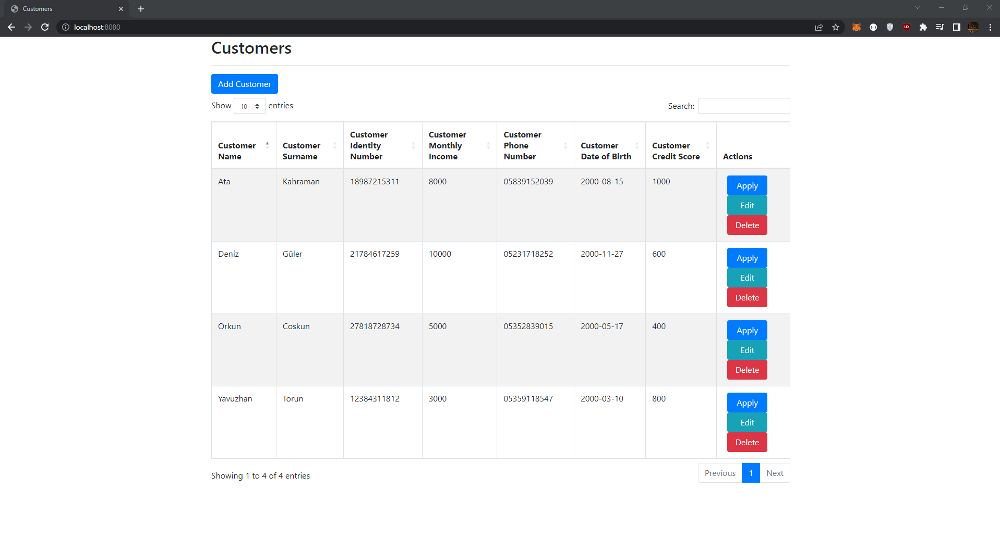
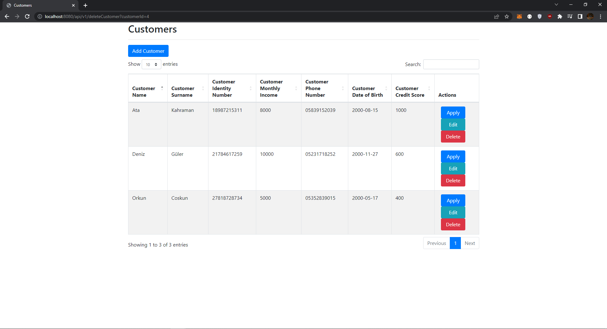

# Credit Application System
- Java 17
- Spring Framework
- Spring Boot
- Spring MVC
- Spring Data (Jpa Hibernate, MySQL)
- Spring Rest (http status)
- Thymeleaf

---
### Rules
- New users can be defined in the system, existing customers can be updated or deleted.

- If the credit score is below 500, the user will be rejected. (Credit: Rejected)

- If the credit score is between 500 points and 1000 points and the monthly income is below 5000 TL, the loan application of the user is approved and a limit of 10.000 TL is assigned to the user. (Credit Result: Approved). If he has given a guarantee, 10 percent of the amount of the guarantee is added to the credit limit.

- If the credit score is between 500 points and 1000 points and the monthly income is between 5000 TL and 10,000 TL, the user's loan application is approved and a 20,000 TL limit is assigned to the user. (Credit Result: Approved) If a guarantee is given, 20 percent of the guarantee amount is added to the credit limit.

- If the credit score is between 500 points and 1000 points and the monthly income is above 10.000 TL, the loan application of the user is approved and the user is assigned a limit of MONTHLY INCOME INFORMATION * CREDIT LIMIT MULTIPLIER/2. (Credit Result: Approved) If a guarantee is given, 25 percent of the guarantee amount is added to the credit limit.

- If the credit score is equal to or above 1000 points, the user is assigned a limit equal to MONTHLY INCOME * CREDIT LIMIT MULTIPLIER. (Credit Result: Approved) If a guarantee is given, 50 percent of the guarantee amount is added to the credit limit.

- As a result of the conclusion of the loan, the relevant application is recorded in the database. Afterwards, an informative SMS is sent to the relevant phone number and the approval status information (Rejected or Approved) and limit information are returned from the endpoint.

- A completed loan application can only be queried with the ID number and date of birth. If the date of birth and identity information do not match, it should not be questioned.

- Notes: The credit limit multiplier is 4 by default.

---

### Project Steps
1. @Bean (ModelMapper)
2. Dto
3. BaseEntity (@MappedSuperclass)
4. CustomerEntity (@Entity)
5. CustomerRepository (@Repository)
6. CustomerServices (interface)
7. CustomerServiceImpl(@Service)
8. ResourceNotFoundException(@ResponseStatus)
9. CustomerController(@Controller)
10. CustomerRestController(@RestController)

---

### Unit Test
1. TestCrud (interface)
2. @SpringBootTest

---

### Auditing
1. AuditorAwareBean
2. AuditorAwareImpl (implements AuditorAware)
3. @SpringBootApplication


## Postman
```sh
// SAVE
http://localhost:8080/api/v1/customers


//LIST
http://localhost:8080/api/v1/customers


//FIND
http://localhost:8080/api/v1/customers/1


//UPDATE
http://localhost:8080/api/v1/customers/1


//DELETE
http://localhost:8080/api/v1/customers/1

//APPLY FOR CREDIT
http://localhost:8080/api/v1/apply/1
```

# Postman Output Images

### Save

### Find

### Update

### Delete

### Rejected Application

### Approved Application


# Frontend Images

### View Customers Page

### Add Customer Page

### Update Customer Page

### Delete Customer Page
When we delete the customer, we will return to the customers page.

### Rejected Application Page

### Approved Application Page

